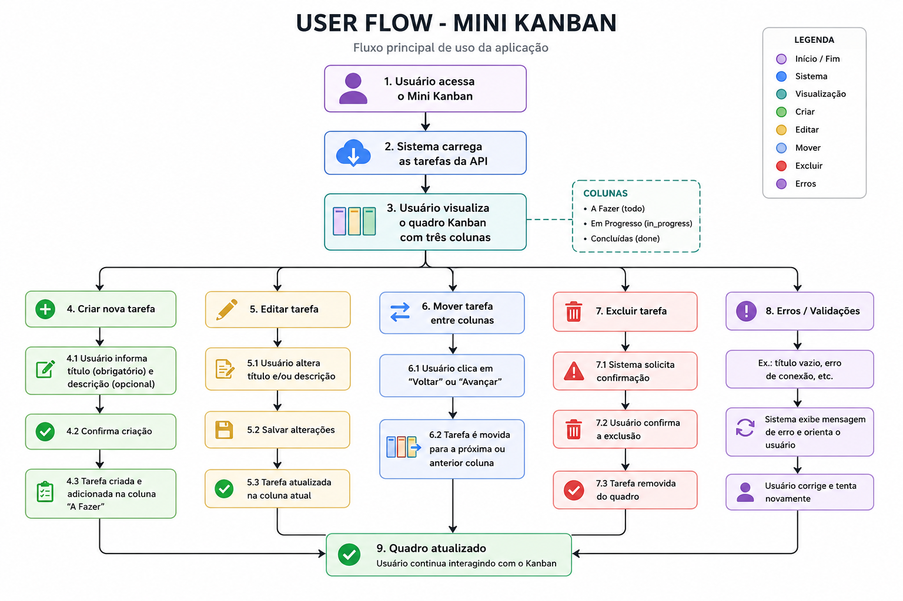

# Mini Kanban — Desafio Fullstack Veritas

Aplicação Full Stack de um quadro Kanban simplificado, desenvolvida como parte do Desafio Fullstack da Veritas.

O sistema permite criar, visualizar, editar, mover e excluir tarefas organizadas em três etapas:

- **A Fazer**
- **Em Progresso**
- **Concluídas**

---

## Tecnologias utilizadas

### Frontend

- React
- TypeScript
- Vite
- CSS

### Backend

- Go
- `net/http`
- API REST
- Armazenamento em memória

---

## Funcionalidades

- Criar novas tarefas
- Informar título e descrição
- Editar tarefas existentes
- Excluir tarefas
- Mover tarefas entre as colunas
- Visualizar quantidade de tarefas em cada coluna
- Validação de título obrigatório
- Validação dos status das tarefas
- Feedback visual de carregamento
- Feedback de erros
- Interface responsiva
- Integração entre frontend e backend através de API REST

---

## Estrutura do projeto

```text
desafio-fullstack-veritas/
│
├── backend/
│   ├── main.go
│   ├── handlers.go
│   ├── go.mod
│   └── ...
│
├── frontend/
│   ├── src/
│   │   ├── components/
│   │   │   ├── Column.tsx
│   │   │   └── TaskCard.tsx
│   │   ├── App.tsx
│   │   ├── App.css
│   │   └── ...
│   ├── package.json
│   └── ...
│
├── docs/
│   └── user-flow.png
│
└── README.md
```

---

## Como executar o projeto

### Pré-requisitos

Para executar o projeto é necessário possuir:

- Go instalado
- Node.js instalado
- npm instalado

---

### Backend

Abra um terminal e acesse a pasta do backend:

```bash
cd backend
```

Execute:

```bash
go run .
```

A API ficará disponível em:

```text
http://localhost:8080
```

---

### Frontend

Abra outro terminal e acesse a pasta do frontend:

```bash
cd frontend
```

Instale as dependências:

```bash
npm install
```

Execute o projeto:

```bash
npm run dev
```

O frontend ficará disponível normalmente em:

```text
http://localhost:5173
```

Mantenha o backend e o frontend executando simultaneamente.

---

## API

A aplicação utiliza os seguintes endpoints:

| Método | Endpoint | Descrição |
|---|---|---|
| GET | `/tasks` | Lista todas as tarefas |
| POST | `/tasks` | Cria uma nova tarefa |
| PUT | `/tasks/:id` | Atualiza uma tarefa |
| DELETE | `/tasks/:id` | Exclui uma tarefa |

### Estrutura de uma tarefa

```json
{
  "id": 1,
  "title": "Codar Kanban",
  "description": "Prazo final 14/08",
  "status": "todo"
}
```

Os status aceitos são:

| Status | Coluna |
|---|---|
| `todo` | A Fazer |
| `in_progress` | Em Progresso |
| `done` | Concluídas |

---

## Validações

O backend realiza validações básicas antes de salvar ou atualizar uma tarefa.

O título é obrigatório e não pode conter apenas espaços.

Também são aceitos somente os seguintes status:

```text
todo
in_progress
done
```

Requisições inválidas recebem uma resposta HTTP de erro.

---

## Arquitetura

O projeto foi dividido em duas aplicações independentes.

O **frontend**, desenvolvido em React e TypeScript, é responsável pela interface e interação com o usuário.

O **backend**, desenvolvido em Go, disponibiliza uma API REST responsável pelo gerenciamento das tarefas.

A comunicação acontece através de requisições HTTP:

```text
React
   │
   │ HTTP / JSON
   ▼
API Go
   │
   ▼
Armazenamento em memória
```

O backend possui configuração de CORS para permitir a comunicação com o frontend durante o desenvolvimento.

---

## Decisões técnicas

### Armazenamento em memória

Foi utilizado armazenamento em memória para manter a implementação simples e focada nos requisitos do MVP.

Por esse motivo, as tarefas são perdidas quando o servidor backend é reiniciado.

### Componentização

O frontend foi dividido em componentes para reduzir repetição de código e facilitar a manutenção.

Os principais componentes são:

- `Column`: representa cada coluna do Kanban.
- `TaskCard`: representa individualmente uma tarefa.

O componente `App` concentra o estado principal das tarefas e a comunicação com a API.

### Movimentação das tarefas

Cada tarefa possui um `status` que determina em qual coluna ela será exibida:

```text
todo → A Fazer
in_progress → Em Progresso
done → Concluídas
```

Ao mover uma tarefa, o frontend envia uma requisição `PUT` para atualizar seu status no backend.

---

## User Flow

O fluxo principal de utilização da aplicação está representado abaixo:



---

## Responsividade

A interface foi desenvolvida para se adaptar a diferentes tamanhos de tela.

Em telas maiores, as três colunas são exibidas lado a lado. Em telas menores, elas são reorganizadas verticalmente.

---

## Limitações

A principal limitação atual é o armazenamento em memória. Ao reiniciar o backend, as tarefas cadastradas são perdidas.

O projeto também utiliza botões para movimentar as tarefas entre as colunas, não possuindo Drag and Drop nesta versão.

---

## Possíveis melhorias futuras

- Drag and Drop entre as colunas
- Persistência das tarefas em banco de dados ou arquivo JSON
- Testes automatizados
- Docker
- Autenticação de usuários
- Busca e filtros de tarefas
- Prioridades e datas para as tarefas
